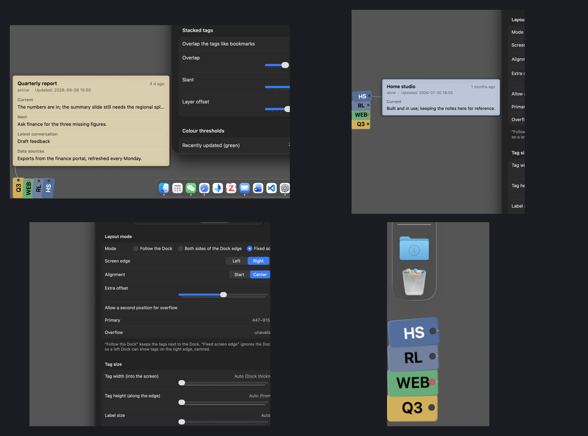
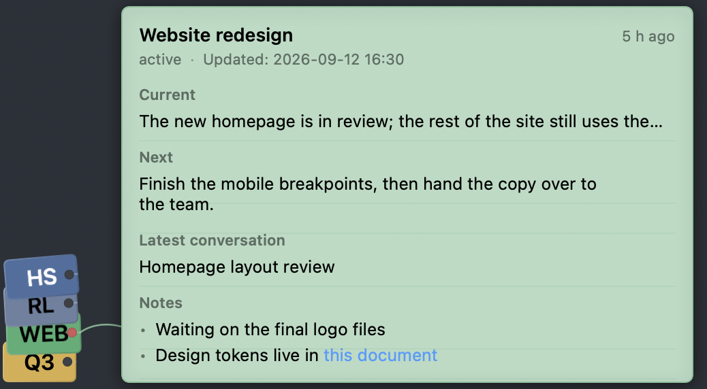
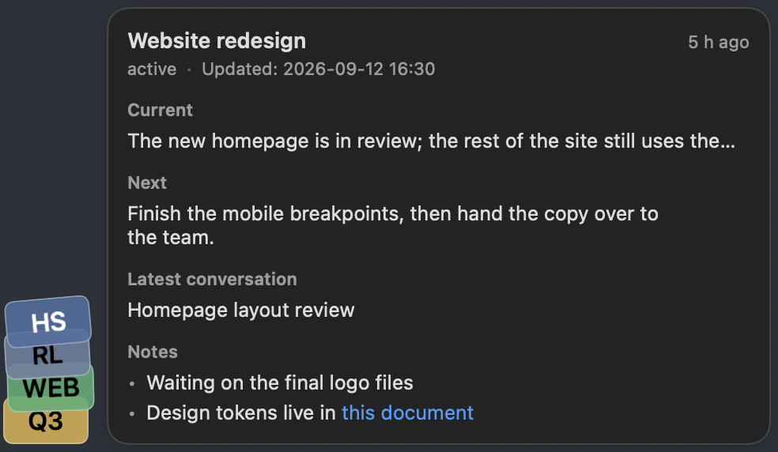
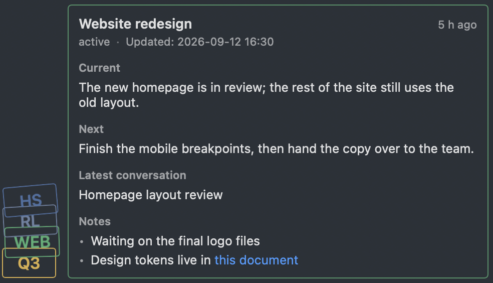

# HudEX

**English** · [中文](README.md)

**Always present, almost invisible.**

HudEX puts a handful of solid-colour bookmarks in the free space along the edge
of your screen — normally right next to the Dock. Each bookmark is one project
you are juggling. Hover it and a small card shows where that project stands,
what is next, and the name of the most recent conversation about it.

Everything comes from **one Markdown file** that you — or an AI — can edit.



*Hover card over the Dock bookmarks · a left-edge Dock with its card · the layout
pane (here pinning the bookmarks to the right edge) · the bookmarks up close.*

## What it is

A tiny, always-on display of *recent project context*, for anyone who keeps
several projects moving at once: a launch, a report, a side project, a reading
list, a room you are renovating.

It answers four questions without you opening anything:

1. Which projects am I in the middle of?
2. Where did each one get to?
3. What is the next step?
4. Which one has gone quiet?

It is **not** a task manager, a calendar, a Kanban board, a note archive or an
AI agent — and it deliberately isn't.

## Quick start

**Install (the drag-and-drop disk image is the recommended way)**

1. Download **`HudEX-1.0.3.dmg`**, open it, and drag **HudEX** onto the
   **Applications** shortcut in the window.
2. **The first launch is blocked by macOS** — HudEX is ad-hoc signed rather than
   notarised (a paid Apple account is not involved), and this happens once:
   - double-clicking HudEX shows *"Apple could not verify HudEX is free of
     malware"*;
   - open **System Settings → Privacy & Security** and scroll to *Security*;
   - there is a line saying HudEX was blocked because it is from an unidentified
     developer — click **Open Anyway**;
   - confirm with your password or Touch ID, then click **Open** once more.
3. That is it. HudEX is signed locally (ad-hoc) and makes no network requests.
   It needs no system access for bookmarks; only Reminders sync requests full
   Reminders access. It does not use Accessibility, Screen Recording, or
   notifications. The "blocked" line in Settings disappears once it has opened.
4. On the first launch HudEX creates its own file
   (`~/Library/Application Support/HudEX/HudEX.md`) and opens a short Welcome
   pane: where the file lives, and which look you want.

> Prefer your own file? Choose it in the Welcome pane — macOS will ask for that
> folder once, and the answer is yours.


## The file

```markdown
## Website redesign          ← one project per `##` heading

short: WEB                   ← optional: the label on the bookmark
status: active               ← active / paused / archived / done
updated: 2026-09-12 16:30    ← drives the colour
priority: high               ← optional: colours the punched hole

### Current                  ← sections; 当前 / 下一步 / 最新对话 / 备注 are
The new homepage is in review; the rest of the site still uses the old layout.

### Next
Finish the mobile breakpoints, then hand the copy over to the team.

### Latest conversation
Homepage layout review
```

* `###` headings are free-form: the four above are recognised and shown in the
  hover card, any other heading (`### Data sources`, …) renders in the full view.
* Extra per-project keys: `order: 1` (position among the bookmarks),
  `color: #4C6FA0` or `color: teal` (override the bookmark colour).
* Chinese keys work too (`短名：`, `状态：`, `更新：`, `顺序：`, `颜色：`, `优先级：`) —
  the two spellings can even be mixed in one file.
* Only text and ordinary `http(s)` links. Images, attachments and embeds are
  never loaded, downloaded or rendered.
* A project with no `short:` gets an abbreviation derived from its title
  (`GeoRule` → `GR`, `Reading list` → `RL`).

Examples: [`Examples/HudEX.md`](Examples/HudEX.md) (English) ·
[`Examples/HudEX.zh.md`](Examples/HudEX.zh.md) (中文)

### Apple Reminders sync

Under **Settings → Source → Apple Reminders sync**, convert the current file
in place to versioned JSON; its path, projects, sections and settings are
preserved. Then choose **Sync Reminders now** and grant HudEX Reminders access.
Each project maps to its own Reminders list, with the project's `reminders`
array mapped to items in that list.

Items can be added, edited and deleted on either side. If both sides change the
same item, the newer modification wins. Sync is started manually from Settings.
Unmarked items in a HudEX-managed list are adopted, so keep those lists for
HudEX project reminders. Markdown files remain supported; back up before
converting.

## First launch

Two things happen on their own:

1. HudEX creates its own file at
   `~/Library/Application Support/HudEX/HudEX.md` — that folder needs no
   authorisation;
2. Settings opens on a **Welcome** pane: where the file is, whether it parsed,
   and which look you want (skeuomorphic by default). The pane disappears once
   there is something to show.

Watching a file somewhere else (Documents, a synced folder, a git checkout) is a
choice you make in that pane — macOS asks for that folder once.

## Where the bookmarks may appear (Settings → General → Desktop)

**Only on the main desktop** is on by default: the bookmarks stay on the desktop
they were created on (desktop 1 when HudEX starts at login) and never appear over
a full-screen app. Turn it off and they follow you to every desktop again.

## Styles

Pick one in **Settings → Appearance**; each option previews itself.

| Skeuomorphic (default) | Frosted glass | Minimal |
|---|---|---|
|  |  |  |
| Coloured paper card with ruled lines; a punched hole joins it to the bookmark with its own little string. | Translucent pane, readable over any background. | Outlines only. |

Every string hangs differently — direction, curve and even the occasional
S-bend come from a stable hash of the project, so the same bookmark always
hangs the same way, and nothing animates while the pointer is still.

## Who manages the content

The file is yours. Write it by hand, have an AI keep it tidy — live or on a
schedule — or keep it in any folder a sync service mirrors for you (iCloud
Drive, OneDrive, Dropbox, WebDAV, a git checkout…). In Markdown mode HudEX only
reads project content; in JSON mode Reminders sync updates task fields. Two Macs
can point at the same synced copy.

The one thing HudEX writes is the settings block described below. Everything
above that block is left byte-for-byte alone.

## Settings live in the file

The bottom of `HudEX.md` holds a documented settings block — one guide line,
then one `key：value` line per option:

```markdown
# HudEX Settings

> Appearance style: skeuomorphic / frosted / minimal
Appearance style：skeuomorphic

> Tag width into the screen, in points. 0 = follow the Dock thickness
Tag width：0
```

Change a value there and HudEX applies it. Change a setting in the app and
HudEX writes it back (debounced, atomically; your project content above is left
untouched). That makes the file fully driveable by a person or an AI — layout,
colours, thresholds, counts, even the style.

## Where the bookmarks go

| Dock | Primary position | Overflow |
|---|---|---|
| Left | bottom-left, growing up | top-left, growing down |
| Right | bottom-right, growing up | top-right, growing down |
| Bottom | bottom-left, growing right | bottom-right, growing left |

Three modes: **follow the Dock** (default), **split both sides of the Dock's
edge**, or **pin to a screen edge of your choice** (left/right/bottom, anchored
start/centre/end, with an offset) — so a left Dock can show bookmarks on the
right edge if you prefer.

Bookmarks are never wider than the Dock, never overlap it and never cover the
menu bar.

**By default they only ever appear in one place**: whatever does not fit is
reported in Settings instead of being drawn somewhere else. Turn on
*Allow a second position for overflow* in Settings → Layout (or
`Overflow slot：on` in the file) if you would rather use both ends of the edge.

## Permissions, network, resources

* **Permissions only when needed.** Bookmarks need no Accessibility or Screen
  Recording access. Reminders sync requests full Reminders access; no network.
  Dock position and thickness come from the system's reserved screen area and
  the Dock's own preferences; screen changes arrive as ordinary notifications.
* **No polling.** No timers except a single one at midnight (colour rollover)
  and a once-a-minute refresh while a card is on screen.
* Measured idle cost: **~0 % CPU, ~16 MB, ~0.1 wakeups/s, 0 network**.

## What it deliberately does not do

No AI calls, no sync service, no built-in editor, no WebView/Electron/Node, no
history, no auto-scroll, no progress bars, no image attachments, no mobile app.
Editing means "open `HudEX.md` in whatever your default Markdown editor is".
Syncing is your sync client's job (the file just has to be local and up to date),
and how the content gets written is yours: by hand, by an AI, or by whatever
already produces your notes.

## Repository layout

```
Sources/HudEXCore     parsing / layout / colour / file signatures — pure logic, unit tested
Sources/HudEXApp      AppKit shell (panels, status item, settings window) + SwiftUI views
Tests/HudEXCoreTests  123 tests: parser, layout modes, stacking, palette, sync, i18n
Examples/             example documents (English + Chinese)
docs/                 design and verification notes
script/               build / install / asset scripts (script/demo.swift sweeps the bookmarks for demo recordings)
```

```bash
swift script/demo.swift 3   # sweeps the bookmarks (for screen recordings)
swift test                  # 123 tests
./script/build_and_run.sh # build + bundle + sign + run
./script/install.sh       # copy to /Applications
```

## Licence

Not chosen yet — add one before publishing.
